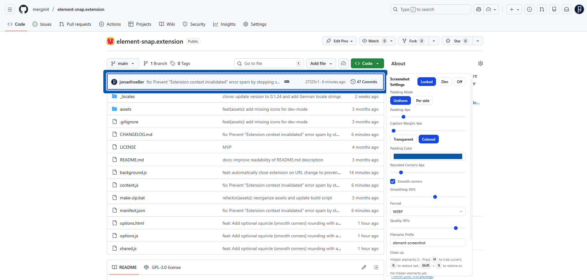
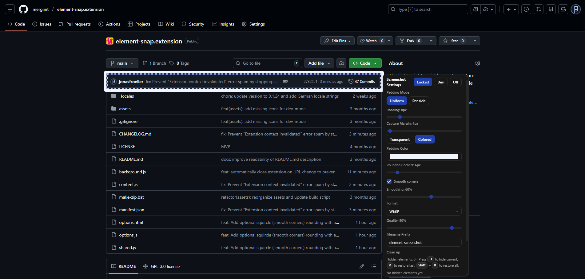
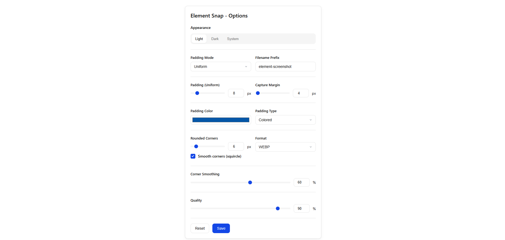
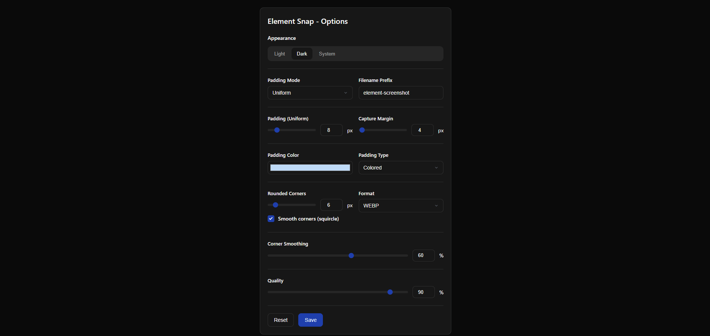

# Element Snap

    

    
      <b><strong style="font-size: 5rem;">Element Snap</strong></b>
       "A lightweight, reliable Chrome extension to capture pixel-perfect screenshots of any HTML element."
    

 

  
  
   
  
  

 

## Why Element Snap?

Unlike other extensions that re-render HTML to an image (often breaking styles), Element Snap takes a screenshot of the visible page. This guarantees that what you see is *exactly* what you get.

This approach is:
* **Reliable:** Preserves 100% of the element's styling, layout, and fonts.
* **Lightweight:** Built with zero libraries-, just vanilla JavaScript and the Chrome API for maximum speed.

> **Note:** For elements within the viewport, a direct screenshot is taken. For larger elements, multiple screenshots are automatically stitched together.

## Features

* **Pixel-Perfect Capture:** Get a flawless image of any hovered element, including elements larger than the viewport.
* **Full Element Capture:** Automatically detects oversized elements and stitches multiple screenshots seamlessly.
* **Live Padding Controls:** Add uniform or per-side padding with a real-time preview.
* **Capture Margin:** Include real page pixels around the element for context.
* **Flexible Output:** Save as PNG, JPG, WEBP, or SVG. Adjust quality for lossy formats.
* **Rounded Corners:** Apply standard or squircle (smooth, iOS-like) corner rounding to exports.
* **Redaction Tools:** Blur, pixelate, or cover sensitive data before sharing.
* **Theme Support:** Light, Dark, or System theme with automatic detection.
* **Element Hiding:** Temporarily hide surrounding elements with a keypress (`H`) for a clean shot.
* **Dim Mode:** Reduce overlay opacity for better visibility of underlying content.
* **Keyboard Shortcuts:** Capture (`Ctrl/Cmd+Click`), lock focus (`L`), restore hidden elements (`R`), and more.

## How to Use

1.  **Activate:** Click the extension icon in your toolbar to turn it on for the current tab.
2.  **Hover:** Move your mouse to highlight the desired element.
3.  **Adjust:** Use the floating panel to change padding, format, and other settings.
4.  **Capture:** `Ctrl/Cmd + Click` the element or press the "Capture" button.

## Installation

**1. From Chrome Web Store (Recommended)**

[chromewebstore.google.com](https://chromewebstore.google.com/detail/element-snap/nldbbahmckpcjcbikdaopeaiidhdomkf)

**2. From Source**

1.  Clone this repository: `git clone https://github.com/jonasfroeller/element-snap.git`
2.  Open Chrome and navigate to `chrome://extensions`.
3.  Enable "Developer mode" in the top-right corner.
4.  Click "Load unpacked" and select the cloned repository folder.

## Privacy & Permissions

- Uses `activeTab` and `scripting` to inject the UI only on demand when you click the extension action.
- Uses `tabs.captureVisibleTab` to screenshot the visible area of the current window; no network transmission occurs.
- Uses `storage.sync` to save UI preferences (padding, format, etc.).
- Uses `downloads` to save images to your device without additional prompts.

No analytics, tracking, or external requests. All processing happens locally in your browser.

## License

This project is licensed under the GPLv3 License. See the `LICENSE` file for details.

Copyright © 2025 Jonas Fröller
